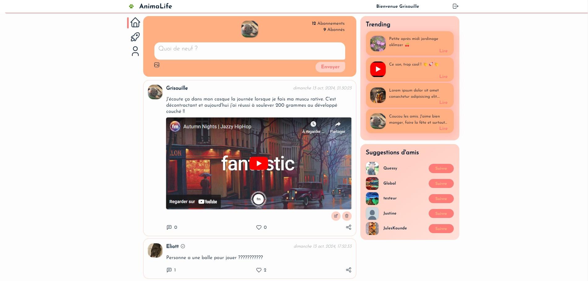

# Base de Réseau Social

## PROJET FULL STACK

---

Réalisé à l'aide d'un tuto de [From Scratch](https://github.com/JustFS) :pray:

**Lien du tuto :** https://www.youtube.com/watch?v=ghdRD3pt8rg

__Lien du repo du tuto :__ https://github.com/JustFS/mern-project

Ceci est une base si vous voulez créer un réseau social type Instagram, X, Facebook.

Je ne prétends pas que ce soit une excellente base, mais cela fait l'affaire pour un petit projet.

Vous pouvez prendre tout le code si cela vous plaît, ou bien simplement une partie pour vos projets, faites comme bon vous semble.

**Stacks utilisées :**
Mongoose (MongoDB), Express, React, Nodejs, Mongoose, Multer, Bcrypt, Redux, Sass...

---

Le type de base de données utilisées est du **NoSQL**.

J'ai utilisé le système de bdd [MongoDB](https://www.mongodb.com/fr-fr)

Le back-end répond à des fichiers de types .JSON uniquement.

---

Pour démarrer le serveur : `npm start`
Pour démarrer le front :  `cd client + npm start`

---

### Back config :

- Mettez vos informations de cluster dans `/config/db.js`
- Créez le fichier `.env` dans `/config/` dans les données suivantes
- PORT=5000 __votre port localhost__
- CLIENT_URL=http://localhost:3000 votre URL client
- DB_USER_PASS= _votre identifiant et mot de passe_
- TOKEN_SECRET=990bf68e6adf1be5f1671bba3bec692056922454 votre clé secrète aléatoire

---

### Exemple de ce que cela donne :
